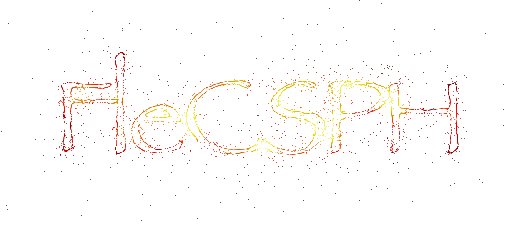

[](https://travis-ci.com/laristra/flecsph)
[](https://codecov.io/github/laristra/flecsph?branch=master)
<!---
[](https://sonarqube.com/dashboard?id=flecsph%3A%2Fmaster)
--->

# SPH with FleCSI

This project implements smoothed particles hydrodynamics (SPH) method of
simulating fluids and gases using the FleCSI framework.
Currently, particle affinity and gravitation is handled using the parallel
implementation of the octree data structure provided by FleCSI.

We provide several examples of physics problems in 1D, 2D and 3D:

- Sod shock tubes in 1D/2D/3D;
- Noh shock test in 2D/3D;
- Sedov blast waves 2D and 3D;
- airfoil flow in a wind tunnel (2D/3D);
- pressure-induced spherical implosion (2D/3D);
- single and binary stars with Newtonian gravity in 3D.

# Building the FleCSPH

FleCSPH can be installed anywhere in your system; to be particular, below we
assume that all repositories are downloaded in FLECSPH root directory `${HOME}/FLECSPH`.

## Suggested directory structure

We recommend to use an isolated installation of FleCSPH and FleCSI, such that the software and all their
dependencies in a separate directory, with the following directory structure:

```{engine=sh}
  ${HOME}/FLECSPH
  ├── flecsi
  │   └── build
  ├── flecsph
  │   ├── build
  │   └── third-party-libraries
  └── local
      ├── bin
      ├── include
      ├── lib
      ├── lib64
      └── share
```

Below we use `${HOME}/FLECSPH/local` for an installation directory.
Make sure to set your CMAKE prefix to this location:

    % export CMAKE_PREFIX_PATH=${HOME}/FLECSPH/local

## Prerequisites

You will need the following tools:

- C++17 - capable compiler, such as gcc version >= 7;
- git version > 2.14;
- MPI libraries, compiled with the gcc compiler above and multithread support
  (`--enable-mpi-thread-multiple` for OpenMPI and
   `--enable-threads=multiple` for MPICH);
- cmake version > 3.7;
- boost library version > 1.59;
- Python version > 2.7.
- HDF5 compiled with parallel flag version > 1.8

## FleCSI

Clone FleCSI repo and change to the `feature/flecsph` branch.
Checkout submodules recursively, then configure as below:

```{engine=sh}    
   export CMAKE_PREFIX_PATH=${HOME}/FLECSPH/local
   cd $HOME/FLECSPH
   git clone --recursive git@github.com:laristra/flecsi.git
   cd flecsi
   git checkout feature/flecsph
   git submodule update --recursive
   mkdir build ; cd build
   cmake .. \
       -DCMAKE_INSTALL_PREFIX=$CMAKE_PREFIX_PATH  \
       -DENABLE_MPI=ON                            \
       -DENABLE_MPI_CXX_BINDINGS=ON               \
       -DENABLE_OPENMP=ON                         \
       -DCXX_CONFORMANCE_STANDARD=c++17           \
       -DENABLE_CLOG=ON                           \
       -DFLECSI_RUNTIME_MODEL=mpi                 \
       -DENABLE_FLECSIT=OFF                       \
       -DENABLE_FLECSI_TUTORIAL=OFF               
```    

In this configuration, MPI is used as FleCSI backend.
If you want to use other FleCSI backends (Legion, HPX), you will need to install them separately: see https://github.com/laristra/flecsi-third-party for further info.

In a final step, build and install:

    % make -j install

## FleCSPH

Clone the master branch from the FleCSPH git repo:
```{engine=sh}
   cd $HOME/FLECSPH
   git clone --recursive git@github.com:laristra/flecsph.git
```    

### Building FleCSPH

Configure command:

```{engine=sh}
   # in ${HOME}/FLECSPH/build:
   export CMAKE_PREFIX_PATH=${HOME}/FLECSPH/local
   cmake .. \
       -DCMAKE_INSTALL_PREFIX=$CMAKE_PREFIX_PATH  \
       -DENABLE_MPI=ON                            \
       -DENABLE_OPENMP=ON                         \
       -DENABLE_UNIT_TESTS=ON                     \
       -DCXX_CONFORMANCE_STANDARD=c++17           \
       -DENABLE_CLOG=ON                           \
       -DENABLE_MPI_THREAD_MULTIPLE=ON            \
       -DHDF5_IS_PARALLEL=ON                      \
       -DCLOG_STRIP_LEVEL=1                       \
       -DENABLE_UNIT_TESTS=ON                     \
       -Wno-dev
```

Build and install:

    % make -j install


### Building FleCSPH on various architectures
Architecture-/machine-specific notes for building FleCSPH are collected in
[doc/machines](https://github.com/laristra/flecsph/tree/master/doc/machines).
If you succeeded in compiling and running FleCSPH on new architectures,
please do not hesitate to share your recipe.
We appreciate user contributions.

# Running FleCSPH applications
Current FleCSPH contains several initial data generators and two evolution
drivers: `hydro` and `newtonian`. Initial data generators are located in
`app/id_generators/`:

- `sodtube`: 1D/2D/3D sodtube shock test;
- `sedov`: 2D and 3D Sedov blast wave;
- `noh`: 2D and 3D Noh implosion test.
- etc.

Evolution drivers are located in `app/drivers`:

- `hydro`: 1D/2D/3D hydro evolution without gravity;
- `newtonian`: 3D hydro evolution with self-gravity.

To run a test, you also need an input parameter file, specifying parameters of the
problem. Parameter files are located in `data/` subdirectory. Running an
application consists of two steps:

- generating initial data;
- running evolution code.

For instance, to run a `sodtube` 1D shock test, do the following (assuming
you are in your build directory after having successfully built FleCSPH):
```{engine=sh}
  cp ../data/sodtube_t1_n1000.par sodtube.par
  # edit the file sodtube.par to adjust the number of particles etc.
  app/id_generators/sodtube_1d_generator sodtube.par
  app/driver/hydro_1d sodtube.par
```

# Creating your own initial data or drivers
You can add your own initial data generator or a new evolution module under
`app/id_generators` or `app/drivers` directories. Create a directory with
unique name for your project and modify `CMakeLists.txt` to inform the cmake
system that your project needs to be built.

A new initial data generator usually has a single `main.cc` file and an optional
include file. You can use existing interfaces for lattice generators or equations
of state in the `include/` directory.
The file `app/drivers/include/user.h` defines the dimensions of your problem, both
for initial data generators and for the evolution drivers.
This is done via a compile-time macro `EXT_GDIMENSION`, which allows users to have
the same source code for different problem dimensions. Actual dimension is set at
compile time via the `target_compile_definitions` directive of cmake, e.g.:
```
   target_compile_definitions(sodtube_1d_generator PUBLIC -DEXT_GDIMENSION=1)
   target_compile_definitions(sodtube_2d_generator PUBLIC -DEXT_GDIMENSION=2)
```

A new evolution driver must have a `main.cc` and `main_driver.cc` files. Do not edit
`main.cc`, because FleCSI expects certain format of this file. It is easier to start
by copying existing files to your folder under `app/drivers`. Include cmake
targets with different dimensions using examples in `app/drivers/CMakeLists.txt`.

Make sure to document your subproject in a corresponding `README.md` file
that describes the problem you want to run. In order to get all files easily and
correctly, you can copy them from other subprojects such as `sodtube` or `hydro`.

# For developers
Please refer to the following page:
[Development Guidelines](https://github.com/laristra/flecsph/blob/doc/hlim/doc/development.md)

## Style guide

FleCSPH follows the FleCSI coding style, which in turn follows (in general) the Google coding conventions.
FleCSI coding style is documented here:
https://github.com/laristra/flecsi/blob/master/flecsi/style.md

# Logs

Cinch Log is the logging tool for this project.
In order to display log set the environment variable as:
```bash
export CLOG_ENABLE_STDLOG=1
```

In the code, you can set the level of output from trace(0) and info(1) to warn(2), error(3) and fatal(4).
You can then control the level of output at compile time by setting the flag `CLOG_STRIP_LEVEL`:
by default it is set to 0 (trace), but for simulations it is perhaps preferrable to set it to 1 (info).
```cpp
clog(trace) << "This is verbose output  (level 0)" << std::endl;
clog(info) << "This is essential output (level 1)" << std::endl;
clog(warn) << "This is a warning output (level 2)" << std::endl;
clog(fatal) << "Farewell!" << std::endl;
```

For further details, refer to the documentation at:
https://github.com/laristra/cinch/blob/master/logging/README.md

 # Contacts

 If you have any questions or concerns regarding FleCSPH, please contact Julien Loiseau (jloiseau@lanl.gov), Oleg Korobkin (korobkin@lanl.gov) and/or Hyun Lim (hylim1988@gmail.com)
